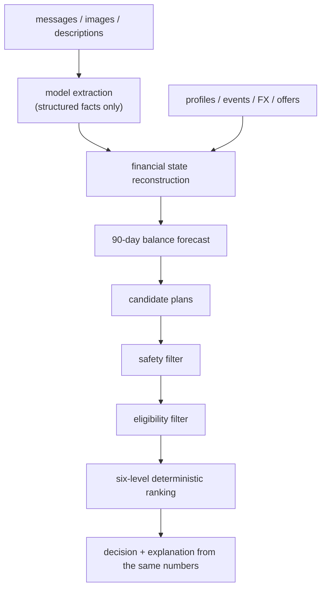

# Affordability Engine

[](https://github.com/vidit-16/affordability-engine/actions/workflows/ci.yml)
[](LICENSE)
[](https://www.python.org/)
[](https://github.com/astral-sh/ruff)

**Should this user buy now, pay in parts, use instalments, wait — or not proceed at all?**

An engine that answers that question for a financial request, and guarantees the
answer is safe: the user's balance never falls below the cushion they want to
keep, at any point in the next 90 days.

Built in 24 hours, solo, for **HackerRank Orchestrate (September 2026)**, a global
hackathon. The competition's dataset and problem statement aren't redistributed
here; this repository contains only the engine I wrote, plus a generator for a
synthetic dataset in the same schema so anyone can run it.

---

## The idea

This looks like a judgement call. It isn't.

The problem defines "safe" precisely — *the balance never drops below the
minimum for 90 days* — and then defines how to choose between safe options with
a fixed six-level ordering. When the rules are that exact, **the answer is
computable, not predictable.**

So the engine is a solver rather than an agent loop, and a model is never asked
what the user should do:

> **The model describes. Deterministic code decides.**

A model reads the unstructured evidence — payroll messages, document images,
transaction descriptions — and returns structured facts. Everything after that
is ordinary code: reconstruct the cash flow, forecast 90 days, enumerate every
candidate plan, discard the unsafe ones, rank what remains.



The central quantity turns out to be one subtraction. Paying *X* today lowers the
entire future balance by exactly *X*, so:

```
amount safe to pay today = lowest balance over the next 90 days − minimum cushion
```

No search, no estimation.

## Quick start

No API key, no external data:

```bash
pip install -r code/requirements.txt
python data/generate_synthetic.py        # 250 users, ~25,000 transactions
cd code
python main.py run                       # writes ../dataset/output.csv
python main.py verify                    # the full test gate
```

With Docker (batch CLI image, non-root; generates the synthetic dataset at build time):

```bash
docker build -t affordability-engine .
docker run --rm affordability-engine run      # or: verify, validate, sanity
```

Development tooling (ruff, pytest, coverage):

```bash
pip install -r requirements-dev.txt
python data/generate_synthetic.py
ruff check .
python -m pytest --cov                   # run from the repo root
```

## Results

Measured on the competition's 25 labelled requests:

| | |
|---|---|
| Mean exact match across all seven output columns | **71.4%** |
| Payment method correct | 88% |
| Affordability status correct | 80% |
| Model calls for 250 requests / total cost | 395 / **$0.50** |
| Contribution of the model layer (measured by ablation) | **+5.1 points** |

The synthetic dataset has no independent ground truth — it's generated, so any
"accuracy" measured against it would be circular. `main.py score` says so rather
than printing a number.

## What I'd point to

**The tests are tested.** Mutation testing injects 26 deliberate faults —
counting unguaranteed income, removing the minimum-balance floor, dropping the
deadline, recommending payment methods the user rejected, converting currency on
the wrong date — and requires the suite to fail on each. It kills 25 of 25
non-equivalent mutants; the last is verified equivalent by diffing every output
row. Every rule in the specification is mapped to the test and the mutant that
prove it in [`docs/SPEC_COMPLIANCE.md`](docs/SPEC_COMPLIANCE.md).

Getting there was the useful part. The first run killed 6 of 10. Later runs
caught subtler failures: an invariant test checking plans with the very function
a mutant broke, an income test that passed with its check deleted because its
request was already capped, and an installment check comparing a plan with the
code that built it. Each is written up in [`docs/TESTING.md`](docs/TESTING.md).

**Planted edge cases found real bugs.** The generator deliberately includes
cancelled authorisations, pending debits and credits, failed payments, employment
that ends mid-history, leave gaps, foreign-currency subscriptions, and messages
that try to instruct the system. Running on it surfaced two defects the
competition data never triggered:

- a partial-payment plan could be built on a forecast that assumed spending
  changes, while reporting the no-change figures — a row contradicting itself;
- a plan could schedule payments *before* the request was made, because the
  solver checked that a plan ended by the deadline but never that it started
  after the request.

**Evidence is untrusted by construction.** The extraction schemas have no field
through which a document could express a recommendation. The strongest thing a
hostile message can do is assert a number — and that number still has to survive
the same forecast as everything else.

**Reproducible to the byte.** Every model call is content-hash cached, and two
consecutive runs are identical across all 250 rows.

## Testing at a glance

| Check | Result |
|---|---|
| `pytest` (unit, guard, invariant, smoke with a mocked model client) | 61 passed, 85% line coverage of `pipelines/` + `orchestrate/` |
| Mutation testing (`python main.py mutate`, 26 hand-written semantic mutants) | 25/25 non-equivalent killed (1 proven equivalent) |
| A/B: `gpt-5-mini` vs `gpt-5` for extraction (full 395-call run) | identical 71.4% accuracy; mini costs $0.50 vs $3.07, so mini ships ([usage report](code/evaluation/usage_report.md)) |
| A/B: model layer on vs off (ablation) | +5.1 points mean exact match |
| Reproducibility | `output.csv` byte-identical across consecutive runs (CI-enforced) |

## Layout

```
data/generate_synthetic.py     seeded dataset + consistent model extractions
code/
  main.py                      run · score · validate · test · verify · mutate
  pipelines/
    sept_state.py              events, FX, normalisation, the Forecast type
    sept_solver.py             candidate generation, ranking, explanations
    sept_extract.py            model extraction schemas and prompts
    sept_validate.py           cross-field decision validation
    september2026.py           recurrence, amendments, projection → row
  orchestrate/                 output contract, model client, cache, config
  evaluation/calibrate.py      joint fit of projection biases, cross-validated
  tests/                       unit · guard · invariant · mutation
.github/workflows/ci.yml       ruff + pytest/coverage, the `verify` gate, Docker build
Dockerfile, pyproject.toml      container image; ruff/pytest/coverage config
requirements-dev.txt           pinned dev tooling on top of code/requirements.txt
docs/                          the documents below
```

Why `code/` is nested: the competition graded a zip of `code/` (built by
`tools/package.py`), with `dataset/` as its sibling. Keeping that layout means the
archive, relative defaults and docs all stay valid, so it was not flattened.

## Documentation

| Document | What it covers |
|---|---|
| [`DESIGN.md`](docs/DESIGN.md) | Why it is built this way: decision logic, calibration, and seven alternatives implemented, measured and rejected |
| [`ARCHITECTURE.md`](docs/ARCHITECTURE.md) | How it is put together: data flow, one request end to end, modules and types |
| [`SCOPE.md`](docs/SCOPE.md) | What it does, what it assumes, what it deliberately does not do, known limitations |
| [`SPEC_COMPLIANCE.md`](docs/SPEC_COMPLIANCE.md) | Every rule, where it is enforced, and the test and mutant that prove it |
| [`TESTING.md`](docs/TESTING.md) | The suites, mutation testing, and what testing the tests uncovered |

## Roadmap

- Property-based tests (Hypothesis) for the forecast and ranking invariants
- Publish the Docker image from CI on tagged releases
- A small HTTP API wrapper around `solve_request` for interactive use
